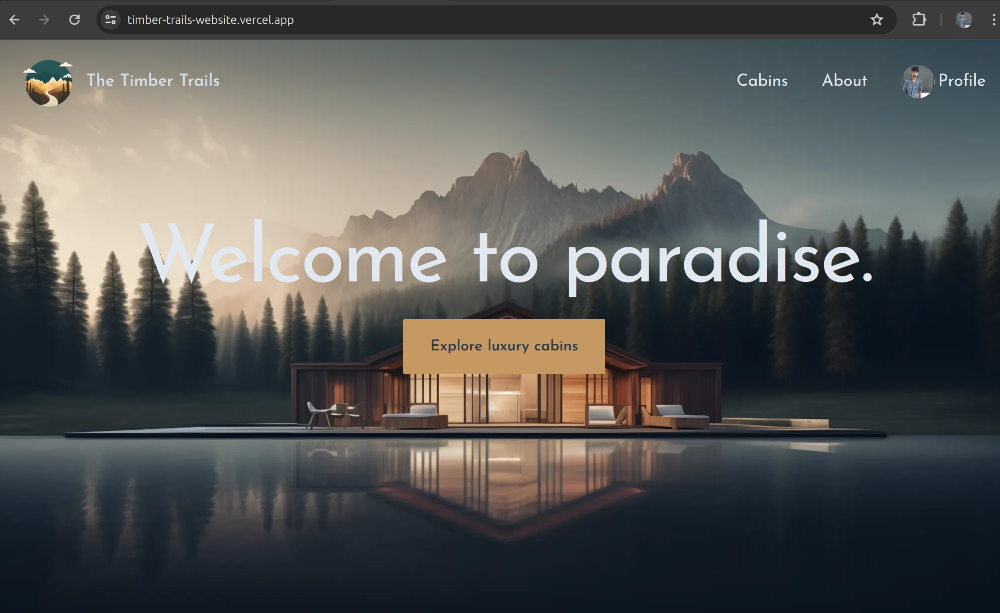

# Timber Trials Customer Facing Website

## Overview

Timber Trials is a sophisticated hotel management website designed to offer users a seamless and intuitive experience for reserving cabins. The platform leverages the power of Next.js to deliver a fast, scalable, and user-friendly interface. Whether you are planning a weekend getaway or a longer stay, Timber Trials provides all the tools you need to browse, book, and manage cabin reservations effortlessly.

**Project Name:** Timber Trials Customer Facing Website

**Technology:** Next.js

## Images

### Home page

 

### Cabins page

 

### Booking page

 

### Reservations page

 

## Features

### Authentication

- **Google Authentication:** Allows users to sign in with their Google accounts.

### Cabins Management

- **Viewing Cabins:** Users can browse and view available cabins.
- **Editing Cabins:** Administrative users can edit cabin details.

### Reservations

- **Create Booking:** Users can create new bookings for cabins.
- **Edit Booked Reservations:** Users can modify their existing reservations.

### User Management

- **Filtering:** Users can filter cabins and reservations based on various criteria.
- **Edit User Details:** Users can update their personal information.

### Additional Features

- Continuous updates and new features to enhance user experience.

## Installation

1. Clone the repository:

   ```sh
      git clone https://github.com/Ronasunil/Timber-Trails-website.git
   ```

2. Navigate to the project directory:

   ```sh
   cd timber-trials
   ```

3. Install dependencies:

   ```sh
   npm install
   ```

4. Set up environment variables:
   Create a `.env.local` file in the root directory and add the following variables:

   ```plaintext
   NEXT_PUBLIC_GOOGLE_CLIENT_ID=your-google-client-id
   NEXT_PUBLIC_GOOGLE_CLIENT_SECRET=your-google-client-secret
   DATABASE_URL=your-database-url
   NEXTAUTH_URL=your-next-auth-url
   ```

5. Run the development server:

   ```sh
   npm run dev
   ```

6. Open [http://localhost:3000](http://localhost:3000) with your browser to see the result.

## Usage

- **Sign In:** Use Google authentication to sign in.
- **Browse Cabins:** View available cabins.
- **Book a Cabin:** Create a new reservation for your preferred cabin.
- **Manage Reservations:** Edit or cancel your existing bookings.
- **Update Profile:** Keep your user details up to date.
- **Filter Options:** Use filters to find the perfect cabin or reservation.
